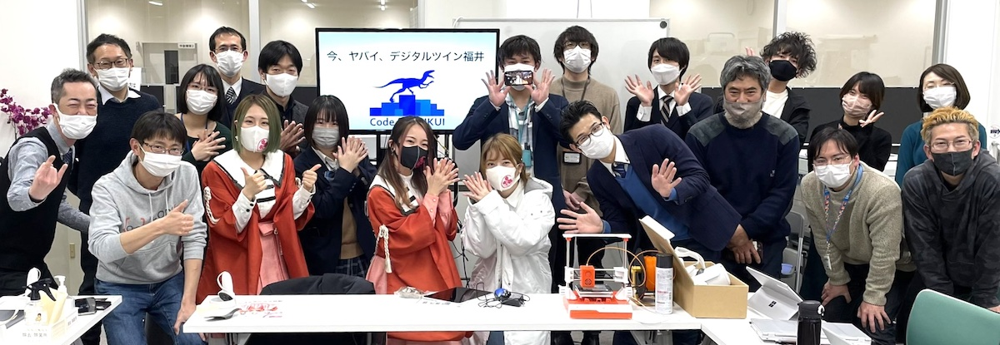

# デジタルツインえちぜん制作実行委員会

つくろう、福井のメタバース！

サイバー空間に双子のようにリアルを再現する「デジタルツイン」を福井で実現するプロジェクトです。

## 関連プロジェクト

- [VRふくい](https://code4fukui.github.io/vr-fukui/)
- [glb-viewer](https://code4fukui.github.io/glb-viewer/)
- [VR地図](https://github.com/code4fukui/vrmap/)
- [高志学リレー講座会場 VRプレゼンデモ](https://fukuno.jig.jp/3509)
- [VR川](https://code4fukui.github.io/vr-river/)
- [VR吉野瀬川ダム](https://code4fukui.github.io/vr-kono/kono.html)
- [VR味真野小学校](https://fukuno.jig.jp/3544)
- [VR東尋坊](https://code4fukui.github.io/vr-tojinbo/)
- [VRうおとめ](https://code4fukui.github.io/vr-uotome/)
- [XRグルメ](https://code4fukui.github.io/xrgourmet/)
- [VR越前武生駅 大観覧車](https://code4fukui.github.io/vr-echizen-takefu/)

## デジタルツインえちぜん制作委員会 名簿

- [デジタルツインえちぜん制作委員会 名簿](members.csv)

## 参加希望、お問い合わせ

mail: code4fukui (＠gmail.com)

## 履歴

- 2022-02-17 [デジタルツインえちぜん製作実行委員会 キックオフ](https://fukuno.jig.jp/3494)
- 2022-03-05 [デジタルツインえちぜん製作実行委員会 勉強会1](https://fukuno.jig.jp/3510)
- 2022-03-20 デジタルツインえちぜん製作実行委員会 制作会1 18:00- [越前市 市民プラザたけふ3F 市民交流センター](https://www.city.echizen.lg.jp/office/010/130030/shiminplazatakefu.html)

## メディア掲載

- [メタバースに　越前市再現を　仮想構築へ　市民団体発足　写真データ活用　イベントも意欲 | 福井新聞2022/02/19](https://www.fukuishimbun.co.jp/articles/-/1491571)
- [仮想空間「メタバース」を使い 越前市の魅力発信｜NHK 2022/02/18](https://www3.nhk.or.jp/lnews/fukui/20220218/3050010440.html)
- [メタバースで越前市を発信…行政の新たな挑戦　北陸新幹線開業向け観光名所再現や交流イベント | 福井新聞2022/02/11](https://www.fukuishimbun.co.jp/articles/-/1491571)
- [2023.4.7 今、デジタルツインがヤバイ！～デジタルツインえちぜん製作実行委員会～｜FUKUI SDGs compass – FM福井 76.1MHz JOLU-FM](http://blog.fmfukui.jp/sdgs/?p=1017)

## 制作

- [Code for FUKUI](..)
- [src on GitHub](https://github.com/code4fukui/code4fukui.github.io/blob/master/digitaltwin/index.md)
